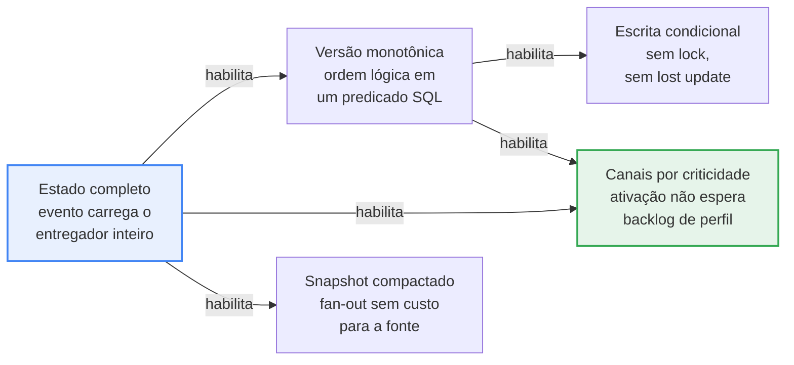

# Motor de Sincronização de Entregadores

**System Design Document** — Desafio Técnico LuizaLabs / Magalu, Logística Ultra Rápida
Candidatura ao nível **Especialista / Staff Engineer**

Arquitetura de um motor que propaga o ciclo de vida de entregadores do **Portal dos Entregadores** para a **Ultra-rápida** e, por construção, para qualquer outra plataforma do ecossistema Magalu que venha a consumir o mesmo fluxo.

---

## Sumário executivo

O sistema se apoia em cinco decisões encadeadas. A ordem importa: cada uma só é segura por causa da anterior.



**1. Eventos carregam estado completo, nunca delta.** Delta exigiria ordem de entrega para produzir estado correto — a única garantia que um pipeline distribuído não dá. Com estado completo, aplicar um evento é atribuição idempotente. ([ADR-013](docs/adr/013-estado-completo-vs-delta.md))

**2. A ordem vem de contador monotônico, não de relógio.** `UPDATE ... WHERE source_version < :sequence`. Zero linhas afetadas significa evento velho; descarta. Reordenação deixa de ser problema de infraestrutura e vira um predicado. ([ADR-003](docs/adr/003-ordenacao-por-versao.md))

**3. A escrita é condicional, sem lock pessimista.** O predicado vive no `WHERE`, então não existe janela entre decidir e escrever. Nas 20 permutações possíveis de dois consumidores concorrentes, **9 perdem a atualização** com read-modify-write ingênuo e **nenhuma** com escrita condicional. ([ADR-004](docs/adr/004-locking.md))

**4. Canais separados por criticidade, não por entidade.** É o que responde à pergunta mais difícil do enunciado: após 2 h de indisponibilidade, a ativação de um entregador drena em segundos em vez de ficar atrás de horas de atualização de perfil. Decisão de topologia, não ajuste de incidente. ([ADR-005](docs/adr/005-fast-lane.md))

**5. Sob degradação, o consumo pausa em vez de falhar rápido.** O log do broker já é a fila durável; despejar o backlog na DLQ trocaria um problema temporário por trabalho permanente de reconciliação, gerado no pior momento. ([ADR-008](docs/adr/008-backpressure.md))

### O que distingue esta entrega

**As invariantes são executáveis.** Idempotência, comutatividade, monotonicidade e convergência não são afirmadas — são propriedades verificadas sobre qualquer sequência gerada. São **76 invariantes** na suíte.

**Os guardrails foram sabotados de propósito.** `bin/sabotage` executa seis violações deliberadas e mostra a saída real de cada barreira. Qualquer avaliador clona e confere.

**Os números vieram de execução, não de estimativa.** Cada afirmação quantitativa deste documento foi medida contra Postgres 16 e Kafka reais.

---

## Como verificar

```bash
git clone https://github.com/elysonromeiro/luizalabs-driver-sync-sdd
cd luizalabs-driver-sync-sdd/harness && bundle install

bundle exec rspec        # 138 exemplos, sem nenhuma dependência externa
```

Com Docker, acrescenta concorrência real e mensageria:

```bash
docker compose up -d             # postgres:16 + kafka
cd harness && bundle exec rspec  # 168 exemplos
bin/sabotage                     # 6 violações deliberadas
bin/mutate                       # 12 mutações
```

| Verificação | Resultado |
|---|---|
| Suíte completa | **168 exemplos, 0 falhas** |
| Invariantes | **76** |
| Mutações mortas | **12 / 12** |
| Sabotagens barradas | **6 / 6** |
| Links da documentação | **179, nenhum quebrado** |

---

## 1. Contexto

A operação de entrega Ultra Rápida executa e acompanha entregas de última milha (*last mile*) em todo o Brasil. Dois sistemas a sustentam:

| Sistema | Papel |
|---|---|
| **Portal dos Entregadores** | *System of Record*. Detém a verdade sobre o entregador: cadastro, manutenção dos dados, gestão documental e o processo de aprovação que determina quem está apto a operar. |
| **Ultra-rápida** | Engine logística que conecta entregadores e clientes dos segmentos *goods* e *food*. Consome os dados do Portal para decidir quem pode receber ofertas de corrida. |

O Portal detém o dado atualizado. A Ultra-rápida precisa dele quase em tempo real — sem o dado corrente, o entregador não recebe oferta, e um entregador bloqueado por segurança continuaria recebendo.

---

## 2. O problema

Sincronizar o ciclo de vida do entregador entre os dois sistemas, respeitando três tensões que puxam em direções opostas:

1. **Latência versus consistência.** O dado precisa chegar rápido, mas nunca corrompido por reprocessamento ou reordenação.
2. **Acoplamento versus autonomia.** A Ultra-rápida tem critérios de elegibilidade *mais restritivos* que o Portal — o Portal aceita entregador pessoa física e a Ultra-rápida não. Essa divergência é legítima e não pode vazar para a fonte.
3. **Especificidade versus generalidade.** A solução atende a Ultra-rápida hoje, mas precisa nascer agnóstica: outras plataformas do ecossistema devem consumir o mesmo fluxo sem reescrita da arquitetura core.

### Requisitos e restrições

| Dimensão | Restrição |
|---|---|
| **Volumetria** | ~300.000 entregadores ativos |
| **SLA de sincronização** | Dado emitido pelo Portal reflete na Ultra-rápida em no máximo **30 s (P99)** |
| **Stack do core** | Ecossistema principal em **Ruby on Rails** |
| **Ciclo de vida** | Criação; ativação/inativação em tempo real (ex.: bloqueio de segurança); atualização de perfil (troca de veículo, mudança de raio de entrega) |
| **Idempotência** | Reprocessar evento antigo ou duplicado não pode corromper o estado do entregador |
| **Concorrência** | Atualizações simultâneas do mesmo entregador, emitidas **fora de ordem**, precisam convergir |
| **Elegibilidade** | Validadores próprios do consumidor, mais restritivos que os da fonte |
| **Segurança** | A arquitetura precisa se manter íntegra sob tentativa de ataque |

---

## 3. Estrutura do documento

### Por onde começar

| Se você quer… | Leia |
|---|---|
| Entender a arquitetura em cinco minutos | O sumário executivo acima, depois [01-arquitetura](docs/01-arquitetura.md) |
| Avaliar profundidade técnica | [02-concorrencia](docs/02-concorrencia.md) e [ADR-004](docs/adr/004-locking.md) |
| Avaliar a resposta ao Pilar 3 | [05-ai-harness](docs/05-ai-harness.md) e [07-repo-ai-native](docs/07-repo-ai-native.md) |
| Avaliar a Seção Especialista | [06-especialista](docs/06-especialista.md) |
| Ver funcionando | [`harness/README.md`](harness/README.md) |

### Documentos

| Pilar | Documento | Conteúdo |
|---|---|---|
| 1 | [01-arquitetura](docs/01-arquitetura.md) | Componentes, C4 e sequências — caminho feliz, evento stale, duplicata, degradação |
| 1 | [02-concorrencia](docs/02-concorrencia.md) | Caminho de escrita, dedupe, lost update, N+1 no Rails |
| 1 | [03-resiliencia](docs/03-resiliencia.md) | Backoff com jitter, circuit breaker, matriz de indisponibilidade, alertas |
| 1 | [04-seguranca](docs/04-seguranca.md) | Modelo de ameaça, mTLS e ACLs, evento forjado, replay, PII |
| 2 | [`contracts/`](contracts/README.md) | AsyncAPI 3.0, OpenAPI 3.0.3, JSON Schemas, política de compatibilidade |
| 3 | [05-ai-harness](docs/05-ai-harness.md) | Três camadas de defesa; L1–L6 da camada detectiva |
| 3 | [07-repo-ai-native](docs/07-repo-ai-native.md) | Camada preventiva: `CLAUDE.md`, hooks, subagents, sabotagem |
| Especialista | [06-especialista](docs/06-especialista.md) | Fan-out, DR na Black Friday, reconciliação, governança |
| — | [`harness/`](harness/README.md) | Harness executável |

### Decisões arquiteturais

Cada uma com as alternativas descartadas e o motivo.

| ADR | Decisão |
|---|---|
| [001](docs/adr/001-broker.md) | Kafka como backbone — replay e compaction decidem, não throughput |
| [002](docs/adr/002-outbox-vs-cdc.md) | Transactional Outbox com relay, CDC como evolução |
| [003](docs/adr/003-ordenacao-por-versao.md) | Ordenação por versão monotônica, não por relógio |
| [004](docs/adr/004-locking.md) | Escrita condicional como padrão, lock pessimista por exceção |
| [005](docs/adr/005-fast-lane.md) | Canais separados por criticidade, não por entidade |
| [006](docs/adr/006-cloudevents.md) | CloudEvents 1.0 como envelope canônico |
| [007](docs/adr/007-pii-e-lgpd.md) | PII fora do evento e apagamento por destruição de chave |
| [008](docs/adr/008-backpressure.md) | Pausar o consumo sob degradação, em vez de falhar rápido |
| [009](docs/adr/009-snapshot-compactado.md) | Tópico compactado como fonte de catch-up e bootstrap |
| [010](docs/adr/010-reconciliacao-por-checksum.md) | Reconciliação por checksum de faixa, não por varredura |
| [011](docs/adr/011-codegen-a-partir-do-schema.md) | Gerar constantes de domínio a partir do schema |
| [012](docs/adr/012-arquitetura-multiagente.md) | Separação de poderes entre agentes de IA |
| [013](docs/adr/013-estado-completo-vs-delta.md) | Eventos carregam estado completo, não delta |

> A ADR-013 está fora de ordem porque foi decidida durante a modelagem dos contratos, depois que 001–012 já estavam planejadas. Renumerar quebraria referências já mergeadas, e o histórico do repositório é parte da entrega.

---

## 4. Cobertura do enunciado

| Requisito | Onde | Executável? |
|---|---|---|
| **Pilar 1** — Diagrama de arquitetura | [01-arquitetura](docs/01-arquitetura.md) — seis diagramas | — |
| **Pilar 1** — Out-of-order events | [ADR-003](docs/adr/003-ordenacao-por-versao.md) | propriedade de comutatividade |
| **Pilar 1** — Optimistic vs pessimistic locking | [ADR-004](docs/adr/004-locking.md) | quatro estratégias contra Postgres real |
| **Pilar 1** — Deduplicação | [02-concorrencia](docs/02-concorrencia.md) | propriedade de idempotência |
| **Pilar 1** — Prevenção de N+1 no Rails | [02-concorrencia](docs/02-concorrencia.md) | contagem de queries constante |
| **Pilar 1** — Exponential backoff | [03-resiliencia](docs/03-resiliencia.md) | `Backoff` com full jitter |
| **Pilar 1** — Circuit breaker | [ADR-008](docs/adr/008-backpressure.md) | pause/resume contra Kafka real |
| **Pilar 2** — AsyncAPI / OpenAPI | [`contracts/`](contracts/README.md) | conformidade nas duas direções |
| **Pilar 2** — `driver.created` | [schema](contracts/schemas/driver.created.schema.json) | exemplo validado |
| **Pilar 2** — `driver.updated` | [schema](contracts/schemas/driver.updated.schema.json) | exemplo validado |
| **Pilar 2** — `driver.status_changed` | [schema](contracts/schemas/driver.status_changed.schema.json) | exemplo validado |
| **Pilar 3** — Harness no CI | [05-ai-harness](docs/05-ai-harness.md) | seis jobs em duas velocidades |
| **Pilar 3** — Testes de propriedade | [`spec/properties/`](harness/spec/properties) | 76 invariantes |
| **Pilar 3** — Impedir alteração de regra de despacho | [golden](harness/spec/golden/dispatch_cases.json) + [CODEOWNERS](.github/CODEOWNERS) | 18 casos congelados |
| **Pilar 3** — Impedir corrupção de idempotência | propriedades + mutação | sabotagem 2 |
| **Pilar 3** — Impedir race condition | [02-concorrencia](docs/02-concorrencia.md) | 20 entrelaçamentos enumerados |
| **Especialista** — Fan-out para N consumidores | [06-especialista](docs/06-especialista.md) | zero queries no bootstrap |
| **Especialista** — DR de 2 h na Black Friday | [06-especialista](docs/06-especialista.md) | fast-lane verificado |
| **Especialista** — Reconciliação e catch-up | [ADR-010](docs/adr/010-reconciliacao-por-checksum.md) | paridade SQL × Ruby |
| **Especialista** — Governança de dados | [06-especialista](docs/06-especialista.md) | `bin/schema_compat` |
| **Segurança** | [04-seguranca](docs/04-seguranca.md) | — |

### Divergências declaradas em relação ao enunciado

| Enunciado | Aqui | Motivo |
|---|---|---|
| "RSpec/FactoryBot" | RSpec + fábricas próprias | Testes de propriedade exigem reprodução por seed; FactoryBot não oferece |
| Core em Ruby on Rails | Harness em Ruby puro | Nenhuma invariante é sobre o ORM; o SQL do Rails está documentado em [02-concorrencia](docs/02-concorrencia.md) |
| "C4 Model ou diagrama sequencial/de blocos" | Blocos e sequência | Os blocos C4 do Mermaid são experimentais e renderizam de forma inconsistente no GitHub |

Detalhado em [`harness/README.md`](harness/README.md).

### O que este desenho não resolve

Declarado porque solução sem limites declarados não foi levada a sério:

- **Insider com acesso legítimo ao Portal** pode aprovar quem não deveria. É segregação de funções na fonte, fora do escopo deste motor.
- **Comprometimento do KMS** derruba tokenização e crypto-shredding juntos. É a dependência de confiança única do desenho.
- **Agente de IA que escreve código correto para o requisito errado.** Nenhum guardrail aqui detecta requisito mal entendido.
- **Erosão lenta** — degradação em incrementos que passam individualmente pelo CI.
- **Adequação jurídica do apagamento por destruição de chave** exige validação do DPO.

---

## 5. Convenções do repositório

- **Documentação em português**; histórico do Git em inglês, no padrão [Conventional Commits](https://www.conventionalcommits.org/).
- `main` é a branch principal. Cada fase de trabalho entrou por uma branch `feature/*` e um Pull Request.
- Diagramas em [Mermaid](https://mermaid.js.org/), renderizados nativamente pelo GitHub.
- O repositório é **AI-native por construção**: [`CLAUDE.md`](CLAUDE.md) é o contrato com agentes, e `.claude/` contém hooks, subagents e skills versionados.

O enunciado original do desafio não é redistribuído aqui; o contexto e os requisitos acima o reproduzem no que é necessário para acompanhar o documento.

---

**Elyson Romeiro** — [github.com/elysonromeiro](https://github.com/elysonromeiro)
