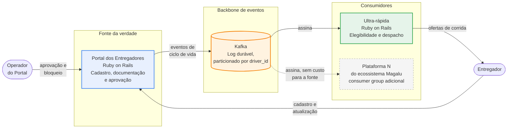
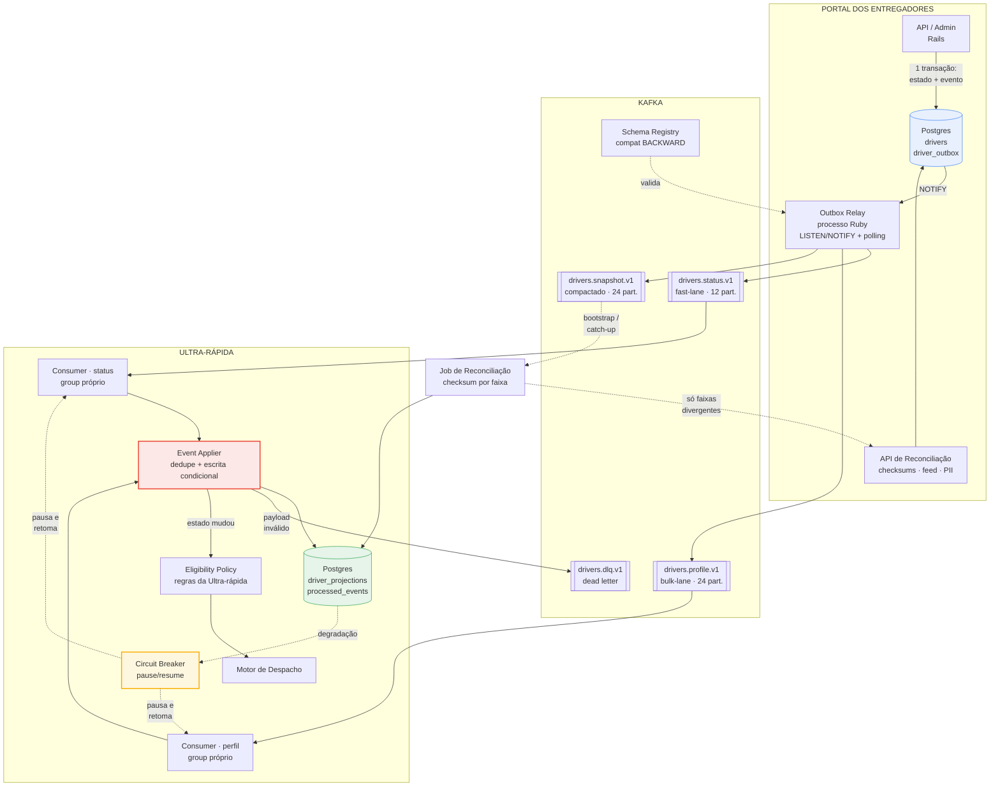
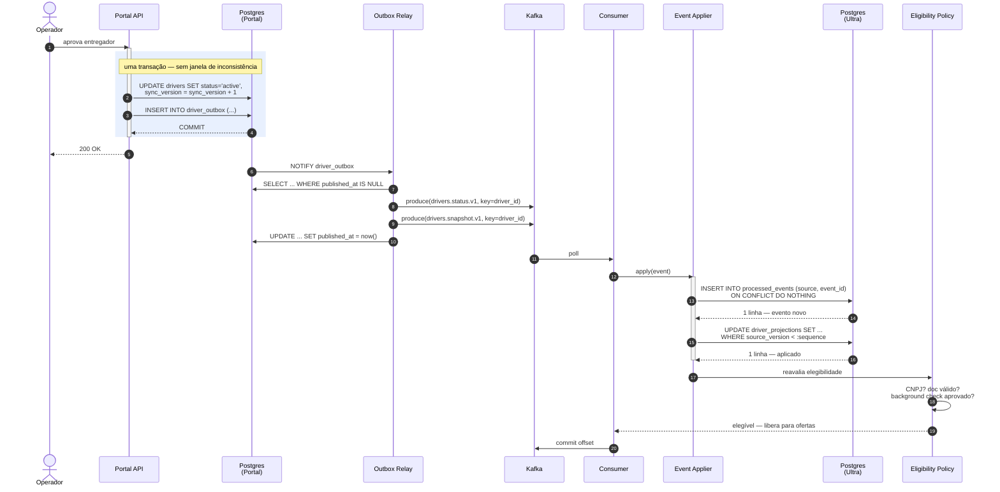
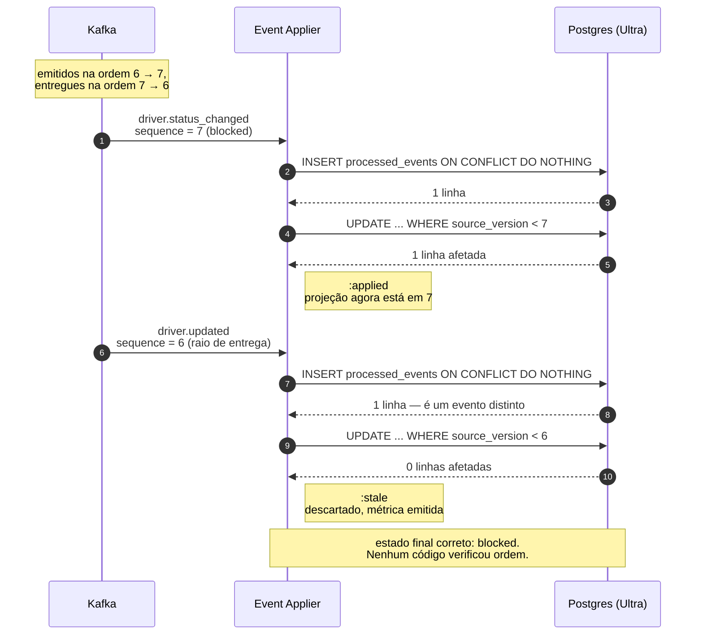
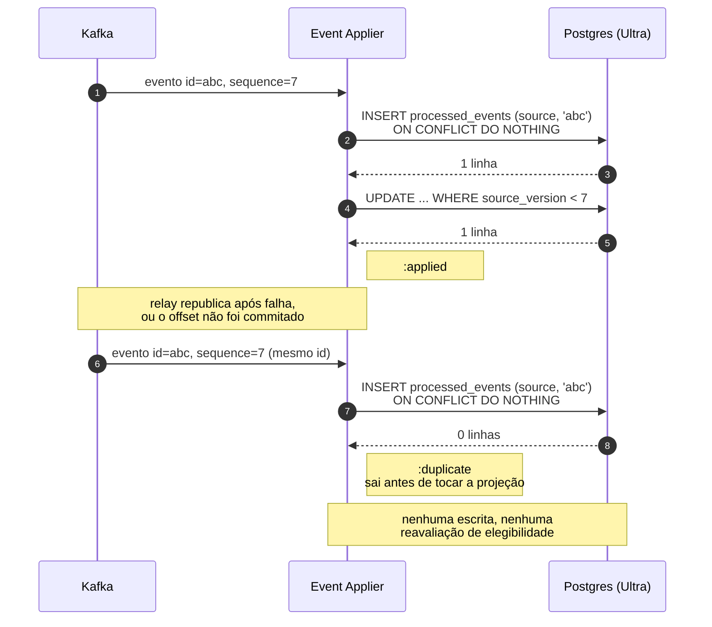
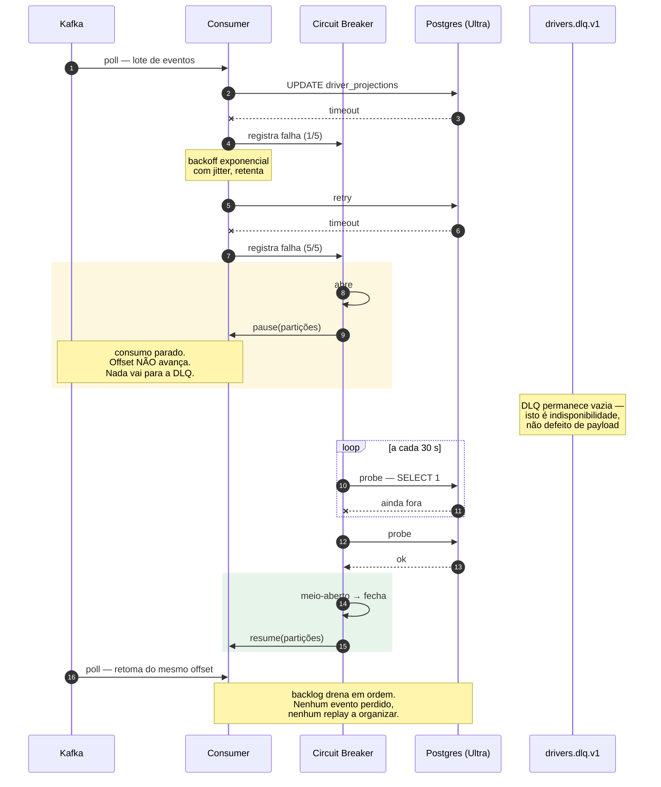

# Arquitetura e fluxo de dados

> **Pilar 1.** Componentes, fronteiras e os caminhos que um fato percorre do Portal até virar decisão de despacho.

## Visão geral

O sistema tem uma forma simples e uma propriedade que vale mais que a forma: **o Portal não conhece seus consumidores**. Ele grava o que aconteceu num log durável e segue adiante. Quem precisa do dado se inscreve.

A seta pontilhada é o requisito de agnosticismo do enunciado. Ela não custa nada ao Portal: uma plataforma nova é um consumer group adicional lendo um log que já existe.

## Componentes

O **Event Applier** está destacado porque é onde mora toda a corretude do sistema. É o único caminho de escrita na projeção, e é ele que o harness protege com testes de propriedade e que a configuração de agentes marca como path protegido.

### Responsabilidades

| Componente | Responsabilidade | Nunca faz |
|---|---|---|
| **API / Admin** | Muda o entregador e grava o evento na mesma transação | Chamar consumidor de forma síncrona |
| **Outbox Relay** | Publica o que foi commitado, em ordem, at-least-once | Decidir conteúdo de evento |
| **Consumer** | Puxa do tópico, entrega ao applier, gerencia offset | Aplicar regra de negócio |
| **Event Applier** | Deduplica, compara versão, escreve condicionalmente | Interpretar elegibilidade |
| **Eligibility Policy** | Decide se o entregador pode receber ofertas | Escrever na projeção |
| **Circuit Breaker** | Pausa e retoma consumo sob degradação | Descartar mensagem |
| **Job de Reconciliação** | Detecta e corrige divergência | Varrer a base inteira |

A separação entre **applier** e **policy** é a que sustenta o requisito de validadores próprios: a projeção guarda o que o Portal disse, a policy decide o que a Ultra-rápida faz com isso. O Portal aceita pessoa física; a Ultra-rápida não. Nenhuma dessas duas verdades precisa da outra, e mudar a regra da Ultra-rápida não exige re-sincronizar nada.

## Fluxo principal

O bloco destacado é o coração da decisão [ADR-002](adr/002-outbox-vs-cdc.md). Estado e evento nascem juntos ou não nascem. Não existe caminho em que o Portal registre uma aprovação que o log desconheça.

Note também a ordem no fim: o offset é commitado **depois** do processamento. É o que torna a entrega at-least-once — e é por isso que a deduplicação existe.

## Evento fora de ordem

O caso que o enunciado pede explicitamente. Dois eventos do mesmo entregador chegam invertidos, seja por replay, rebalanceamento ou pela separação de canais.

O ponto que este diagrama existe para mostrar: **nada no consumidor inspeciona ordem**. A decisão inteira está no predicado do `UPDATE`, e é o banco que a executa atomicamente.

## Evento duplicado

A deduplicação vem antes da escrita condicional de propósito. As duas juntas cobrem coisas diferentes: `processed_events` reconhece o **mesmo fato** reentregue; a comparação de versão reconhece um **fato mais antigo**. Só a segunda não bastaria — reprocessar o mesmo evento passaria pelo `WHERE` se a projeção estivesse atrás, e dispararia reavaliação de elegibilidade em duplicidade.

## Degradação da Ultra-rápida

Este é o desenho de [ADR-008](adr/008-backpressure.md), e a escolha contraintuitiva do documento: sob degradação, **parar de consumir é melhor que falhar rápido**. O log do Kafka já é uma fila durável e ordenada; despejar o backlog na DLQ trocaria um problema temporário por trabalho permanente de reconciliação, gerado exatamente no momento em que o sistema está mais frágil.

## Onde cada requisito é atendido

| Requisito do enunciado | Onde |
|---|---|
| SLA de 30 s no P99 | Outbox com `LISTEN/NOTIFY` (~100 ms) + consumo contínuo — [ADR-002](adr/002-outbox-vs-cdc.md) |
| Idempotência estrita | `processed_events` + escrita condicional — [ADR-003](adr/003-ordenacao-por-versao.md) |
| Eventos fora de ordem | Versão monotônica por entregador — [ADR-003](adr/003-ordenacao-por-versao.md) |
| Concorrência | Escrita condicional sem lock pessimista — [ADR-004](adr/004-locking.md) |
| Validadores próprios | `EligibilityPolicy` separada da projeção |
| Ativação em tempo real | Fast-lane dedicado — [ADR-005](adr/005-fast-lane.md) |
| Arquitetura agnóstica | Consumer group por consumidor, custo zero na fonte — [ADR-001](adr/001-broker.md) |
| Segurança | mTLS, ACL por tópico, PII tokenizada — [04-seguranca.md](04-seguranca.md) |

## Próximas seções

- [Concorrência e idempotência](02-concorrencia.md) — o detalhe do applier, N+1 no Rails
- [Resiliência](03-resiliencia.md) — backoff, circuit breaker, DLQ
- [Segurança](04-seguranca.md) — superfície de ataque e dados pessoais
