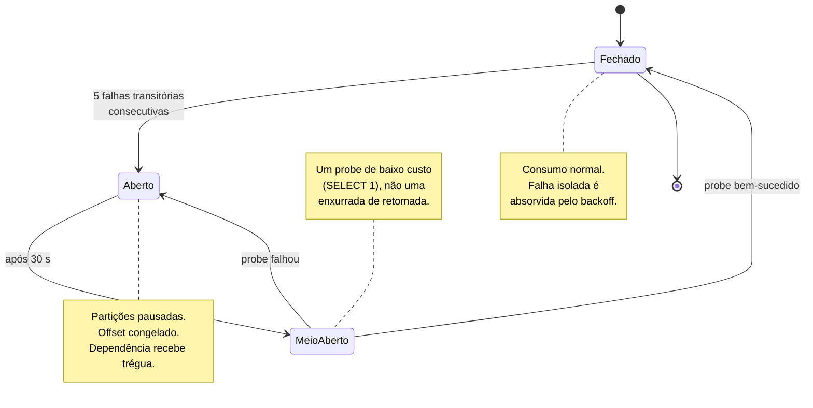

# Resiliência e tolerância a falhas

> **Pilar 1.** Retentativa, circuit breaker e o que acontece com cada componente quando o vizinho cai.

## Princípio

Cada fronteira do sistema tem um plano para a indisponibilidade da próxima, e nenhum desses planos envolve descartar dado. O outbox segura quando o broker cai; o log segura quando o consumidor cai; o consumidor pausa quando o banco cai. **Todo mundo segura, ninguém descarta** — a exceção é o payload permanentemente defeituoso, que é o único caso em que descartar é a resposta certa.

## Retentativa com backoff exponencial e jitter

```ruby
module UltraSync
  class Backoff
    BASE = 0.1      # 100 ms
    CAP  = 30.0     # 30 s
    MAX_ATTEMPTS = 5

    # Full jitter: sorteia no intervalo [0, teto], em vez de aplicar
    # uma variação em torno do teto.
    def delay_for(attempt)
      ceiling = [CAP, BASE * (2**attempt)].min
      rand * ceiling
    end
  end
end
```

**Por que full jitter e não backoff puro.** Backoff exponencial sem aleatoriedade sincroniza os clientes: se cinquenta consumidores falham no mesmo instante porque o banco caiu, todos retentam em 100 ms, depois em 200 ms, depois em 400 ms — em rebanho. Cada onda bate no banco que está tentando se levantar, e frequentemente é a onda que o derruba de novo.

Sortear no intervalo `[0, teto]` — em vez de `teto ± variação` — espalha as tentativas por toda a janela e é a variante que minimiza contenção. O custo é que uma tentativa individual pode ocorrer antes do que ocorreria com backoff puro; o benefício é que o conjunto de tentativas deixa de ter forma de pico.

A sequência de tetos: 100 ms, 200 ms, 400 ms, 800 ms, 1,6 s. Cinco tentativas cobrem o soluço momentâneo. O que passa disso não é soluço — é indisponibilidade, e a resposta muda.

> Implementado em `harness/lib/ultra_sync/backoff.rb`. O `sleeper` é injetável, e os specs usam `Backoff.immediate`: a corretude do consumidor não depende de quanto se espera entre tentativas, e uma suíte de resiliência que leva três segundos por exemplo é uma suíte que ninguém roda.

## Circuit breaker



A transição por **meio-aberto** existe para não trocar uma avalanche por outra. Fechar direto faria o consumidor retomar com todo o backlog acumulado contra um banco recém-recuperado. O probe verifica com uma consulta trivial e só então libera.

### Classificação de erro

A distinção entre transitório e permanente é a decisão mais delicada do componente, porque errar para cada lado tem consequência diferente:

| Classificação errada | Consequência | Recuperável? |
|---|---|---|
| Permanente tratado como transitório | Consumidor trava para sempre num veneno | Só com intervenção |
| Transitório tratado como permanente | Evento válido vai para a DLQ | Sim, por replay |

Por isso a regra é **conservadora e enviesada para dead-letter**: a lista de erros transitórios é fechada e explícita, e tudo que não está nela é permanente.

```ruby
TRANSIENT = [
  PG::ConnectionBad,
  PG::UnableToSend,
  ActiveRecord::ConnectionTimeoutError,
  UltraSync::EligibilityService::Unavailable,
  Errno::ECONNREFUSED,
  Net::ReadTimeout
].freeze

def transient?(error) = TRANSIENT.any? { error.is_a?(_1) }
```

Uma lista aberta — "tudo que não for erro de validação é transitório" — parece mais robusta e é o oposto: qualquer bug novo do consumidor passa a travar o pipeline em vez de gerar um dead letter investigável.

## Matriz de indisponibilidade

| Quem cai | O que acontece | Quem segura | Perda |
|---|---|---|---|
| **Kafka** | Portal continua aceitando escrita; outbox acumula | Disco do Portal | Nenhuma, até o disco encher |
| **Relay** | Outbox acumula; nada é publicado | Disco do Portal | Nenhuma |
| **Consumer** | Lag cresce; log retém | Retenção do Kafka (7 d) | Nenhuma, até a retenção expirar |
| **Postgres da Ultra** | Breaker abre; consumo pausa | Retenção do Kafka | Nenhuma |
| **Serviço de elegibilidade** | Breaker abre; consumo pausa | Retenção do Kafka | Nenhuma |
| **Portal inteiro** | Nada novo é emitido; consumidores ficam com o último estado | — | Nenhuma |

A coluna "quem segura" é a que importa em desenho de resiliência: **para cada falha existe um lugar identificado onde o dado espera**, com capacidade dimensionada e métrica de alerta. Uma arquitetura em que a resposta é "o dado se perde" ou "não sei" tem um buraco ali.

## O que alertar

Alertas sobre causa, não sobre sintoma genérico:

| Métrica | Limiar | O que indica |
|---|---|---|
| Idade da linha não publicada mais antiga no outbox | > 60 s | Relay parado ou Kafka fora |
| Lag do consumer group **de status** | > 1.000 | Fast-lane em apuros — sempre anômalo |
| Lag do consumer group de perfil | > 100.000 | Bulk-lane atrás; tolerável por um tempo |
| Idade da mensagem não consumida mais antiga | > 24 h | Risco real de perda por retenção |
| Mensagens novas na DLQ | > 0 | Defeito de contrato ou de código — sempre acionável |
| Circuit breaker aberto | > 5 min | Dependência não se recuperou sozinha |
| Taxa de eventos stale | pico súbito | Reordenação anômala ou replay não anunciado |

O lag do fast-lane tem limiar duas ordens de grandeza menor que o da bulk-lane de propósito. Ele carrega pouco volume, então qualquer acúmulo ali é anomalia, não carga — o que faz dele um sinal limpo, sem o ruído que tornaria o alerta ignorável.

**Métrica de alerta primária: profundidade da DLQ.** É consequência direta de [ADR-008](adr/008-backpressure.md): como indisponibilidade não gera dead letter, qualquer mensagem ali é defeito real. Numa arquitetura em que a DLQ também recebe ruído de infraestrutura, essa métrica é ignorada em poucas semanas e deixa de servir para o que existe.

## Timeouts

Timeout ausente é indisponibilidade disfarçada de lentidão: sem ele, o pool de conexões esgota e a degradação de uma dependência vira indisponibilidade total do consumidor.

| Chamada | Timeout | Racional |
|---|---|---|
| `statement_timeout` no Postgres | 5 s | Escrita condicional é uma instrução em índice — 5 s já é anomalia |
| Aquisição de conexão do pool | 2 s | Pool esgotado é sinal de pressão, não algo a esperar |
| Serviço de elegibilidade | 3 s | Fica no caminho do consumo |
| Probe do breaker | 1 s | Precisa ser barato para poder ser frequente |

O orçamento total de processamento de um evento fica abaixo de 10 s, com folga confortável contra o SLA de 30 s. A folga é intencional: ela absorve o backoff sem estourar o SLA numa falha isolada.

## O que foi verificado contra broker real

`harness/spec/messaging` executa os cenários acima contra um Kafka de verdade, em vez de descrevê-los:

| Afirmação deste documento | Resultado observado |
|---|---|
| Indisponibilidade não gera dead letter | DLQ vazia; offset permanece em `-1` |
| Lag é o sinal honesto durante a pausa | Lag igual à altura total do log |
| Retomada preserva ordem e não perde evento | Projeção alcança a maior versão do lote |
| Defeito de payload vai para a DLQ | Dead letter com código `unknown_event_type`, breaker fechado |
| Tópico compactado serve catch-up | 100 mensagens sob uma chave → **4 retidas**, redução de 96% |

A última linha é o que sustenta o custo do fan-out: um consumidor novo lê o estado corrente da base sem uma única consulta ao Portal.

## Idempotência é o que torna a retentativa segura

Toda a estratégia acima pressupõe que reprocessar um evento é inofensivo. Sem isso, retentativa e replay seriam fontes de corrupção, e a única saída segura seria entrega exactly-once — que não existe de ponta a ponta em sistema distribuído.

A garantia vem de duas propriedades desenhadas antes: estado completo ([ADR-013](adr/013-estado-completo-vs-delta.md)) e escrita condicional por versão ([ADR-003](adr/003-ordenacao-por-versao.md)). É por isso que resiliência aparece depois de concorrência neste documento — a segunda é pré-requisito da primeira, não o contrário.

## Relacionadas

- [ADR-008](adr/008-backpressure.md) — pausar em vez de falhar rápido
- [ADR-002](adr/002-outbox-vs-cdc.md) — o lado do produtor
- [02-concorrencia.md](02-concorrencia.md) — idempotência que sustenta a retentativa
- [06-especialista.md](06-especialista.md) — recuperação de indisponibilidade longa
