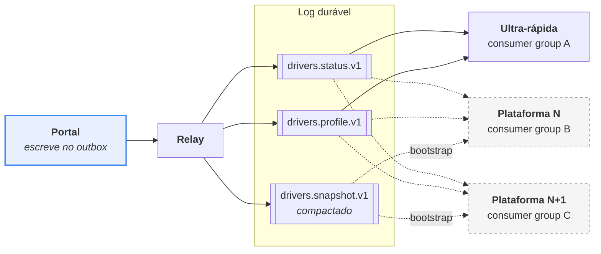
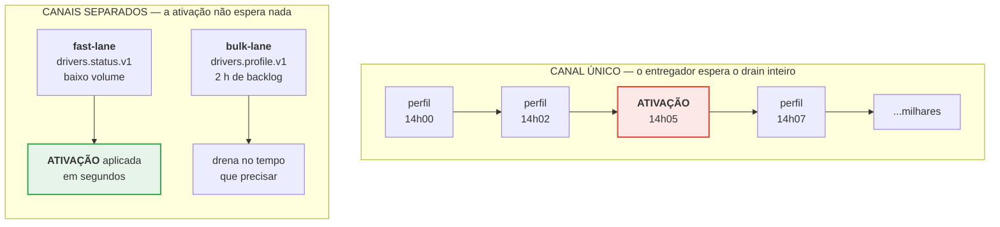
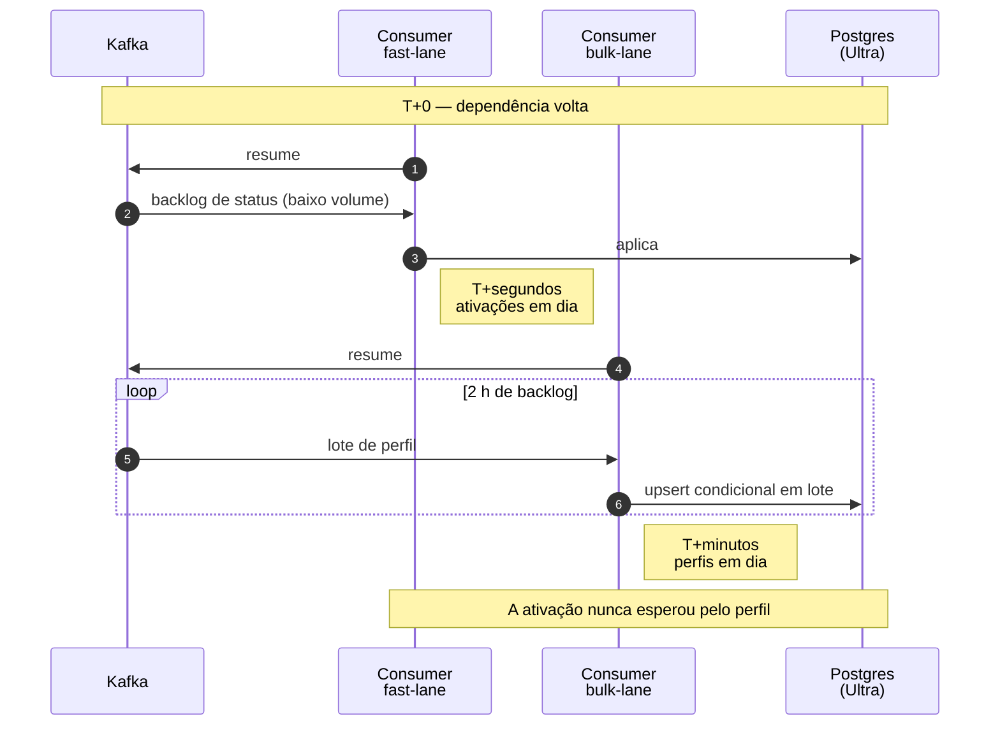

# Seção Especialista

> Extensibilidade multi-plataforma, Disaster Recovery e governança de dados.

---

## 1. Fan-out para N consumidores sem gargalo no Portal

### O que o Portal faz, e o que ele deliberadamente não faz

O Portal grava a mudança e o evento na mesma transação, e segue adiante. **Ele não conhece nenhum consumidor.** Não há lista de assinantes, nem chamada síncrona, nem configuração a atualizar quando alguém novo aparece.

Uma plataforma nova do ecossistema é um **consumer group adicional lendo um log que já existe**. O custo marginal para o produtor é zero — o broker serve do page cache, e o Portal não fica sabendo.

### O que torna isso possível

Três decisões anteriores, e nenhuma delas foi tomada pensando em fan-out:

| Decisão | Contribuição |
|---|---|
| [Outbox](adr/002-outbox-vs-cdc.md) | O Portal nunca chama consumidor. Não há acoplamento a desfazer. |
| [Estado completo](adr/013-estado-completo-vs-delta.md) | Consumidor novo não precisa do histórico — a última mensagem basta. |
| [Snapshot compactado](adr/009-snapshot-compactado.md) | Bootstrap sem uma query no OLTP do Portal. |

A terceira é a que fecha o argumento. Sem ela, "adicionar uma plataforma" significaria varrer 300 mil registros no banco da fonte, e o custo de crescer o ecossistema seria pago por quem não tem nada a ver com ele. **Medido: 0 queries ao Portal durante o bootstrap.**

### Anti-corruption layer em cada consumidor

O evento canônico é traduzido para o modelo local **dentro de cada consumidor**. Regras específicas nunca sobem para a fonte.

É o que já acontece com a Ultra-rápida: ela recusa pessoa física, o Portal não. Essa divergência é legítima, vive na `EligibilityPolicy` do consumidor, e mudá-la não exige re-sincronizar nada nem avisar ninguém.

Se a regra vivesse no Portal, cada plataforma nova com critério próprio exigiria uma mudança na fonte — e a fonte viraria o acúmulo das regras de todos os consumidores, que é a forma clássica de um system of record apodrecer.

### O limite real de escala

Não é o Portal, é a **partição**. Um consumer group escala até o número de partições do tópico; além disso, consumidores ficam ociosos.

Com 24 partições em `drivers.profile.v1` e 12 em `drivers.status.v1`, há folga larga para o volume deste domínio. Aumentar partições depois é possível, mas **redistribui as chaves** e quebra a garantia de ordem durante a transição — por isso o dimensionamento inicial é generoso de propósito. Registrar isso importa: é a decisão difícil de reverter da topologia.

---

## 2. Disaster Recovery — 2 horas fora na Black Friday

### A pergunta certa

O enunciado pede o plano para indisponibilidade total de 2 h, **evitando que um entregador recém-ativado fique impedido de trabalhar no dia**.

A segunda metade é o problema real, e ela não é resolvida por velocidade de recuperação. É resolvida por **ordem de recuperação**.

### Por que o desenho convencional falha aqui

Com um tópico único, a matemática é desfavorável e não há ajuste operacional que a conserte.

Duas horas de backlog, dominado por atualização de perfil — o evento de maior volume. O consumo retoma e a fila drena **em ordem**. A ativação emitida às 14h05 está atrás de todo o tráfego de perfil emitido antes dela.

Aumentar paralelismo não ajuda: a ordem por partição é justamente o que impede pular a fila. Aumentar consumidores não ajuda: o limite é a partição. Não existe fila de prioridade no Kafka.

O entregador espera o drain inteiro. Num dia em que cada hora parada é receita perdida para ele e capacidade perdida para a operação.

### A resposta é topológica, e foi tomada no desenho

[ADR-005](adr/005-fast-lane.md): canais separados por **criticidade**, não por entidade.

O fast-lane carrega uma fração do volume. Após as mesmas 2 h, ele drena em **segundos**, enquanto a bulk-lane leva o tempo que precisar. A ativação chega; a mudança de raio de entrega chega quando chegar, e ninguém se importa.

**Isso não é ajuste de incidente. É escolha de topologia feita meses antes**, e é a diferença entre o entregador trabalhar ou não naquele dia.

### Os três cenários

| Cenário | O que acontece | Quem segura | Perda | Recuperação |
|---|---|---|---|---|
| **Kafka fora** | Portal continua aceitando escrita; outbox acumula | Disco do Portal | nenhuma | Relay drena ao voltar |
| **Consumidor fora** | Lag cresce; log retém | Retenção (7 d) | nenhuma | Retoma do offset |
| **Falha total** | Nada é emitido; consumidores mantêm o último estado | — | nenhuma | Combinação das duas acima |

A coluna **"quem segura"** é o que importa em desenho de recuperação: para cada falha existe um lugar identificado onde o dado espera, com capacidade dimensionada e métrica de alerta. Uma arquitetura em que a resposta é "o dado se perde" ou "não sei" tem um buraco ali.

### O que precisa estar dimensionado antes

Um plano de DR que só descreve a recuperação está incompleto. O que precisa existir **antes** do incidente:

- **Disco do outbox** para o pior caso previsto de indisponibilidade do broker. Métrica de alerta: idade da linha não publicada mais antiga.
- **Retenção do tópico** maior que a maior indisponibilidade plausível do consumidor. Com 7 dias, há folga larga. Métrica: idade da mensagem não consumida mais antiga — não apenas o lag, porque lag alto com retenção sobrando é tolerável e lag alto perto do limite não é.
- **Capacidade de drain** dimensionada para recuperar 2 h de backlog num tempo aceitável. Se drenar 2 h leva 2 h, não há recuperação — só um deslocamento.

### Retomada em ordem de prioridade

### E se a retenção estourar?

O único cenário com perda real. A resposta é a escada de [ADR-010](adr/010-reconciliacao-por-checksum.md), na ordem:

1. **Bootstrap pelo snapshot compactado** — reconstrói tudo, custo zero para o Portal.
2. **Checksums** — confirma que ficou em dia, uma query agregada.
3. **Feed keyset** apenas nas faixas divergentes.

Nunca varredura completa do OLTP. Nunca durante o pico.

---

## 3. Reconciliação sem sobrecarregar o banco

Detalhado em [ADR-010](adr/010-reconciliacao-por-checksum.md). O essencial, com os números medidos:

### A escada

| Degrau | Mecanismo | Custo para o Portal | Quando |
|---|---|---|---|
| 1 | Replay do offset | zero | Consumidor atrás, retenção intacta |
| 2 | Snapshot compactado | zero | Retenção estourada, ou consumidor novo |
| 3 | Checksums por faixa | uma query agregada, em réplica | Verificar se está em dia |
| 4 | Feed keyset nas faixas divergentes | moderado, em réplica | Só o que divergiu |

### Por que checksum funciona

Divide a base em faixas por `hash(driver_id) % buckets` e compara **um número por faixa**, agregado no banco. Nenhum dado de entregador atravessa a rede na detecção.

XOR torna o cálculo independente de ordem, o que dispensa ordenar 300 mil registros no OLTP dos dois lados.

**Medido** em `harness/spec/reconciliation/`:

| Cenário | Resultado |
|---|---|
| Um entregador atrasado entre 1.000 | aponta **exatamente** a faixa dele |
| 5 divergências em 5.000 | **< 5% da base** a transferir |
| Paridade SQL × Ruby, 500 registros | idêntica em todas as faixas |

### O bug que a execução revelou

Vale registrar porque é o tipo de defeito que sobrevive à revisão de código.

Na primeira execução do spec de paridade, as contagens bateram e os checksums não: `-2650426647071125052` contra `15796317426638426564`. **Os mesmos bits** — `bigint` do Postgres tem sinal, `Integer` do Ruby não.

Sem normalização, a reconciliação acusaria divergência em **toda faixa, sempre**, e o sintoma seria indistinguível de drift real. O resultado: carga no OLTP durante uma recuperação, para um problema inexistente. Pior que não ter reconciliação.

O contrato passou a transportar o checksum como hexadecimal, não como número, para que nenhum consumidor reintroduza o problema pela representação numérica da sua linguagem.

### Proteções do degrau 4

- **Sempre em réplica de leitura.** Reconciliação nunca toca o caminho de escrita.
- **Keyset, nunca `OFFSET`.** O spec assere sobre o plano de execução, verificando uso do índice composto.
- **Rate limit adaptativo.** O teto cai sob carga; o cliente respeita `Retry-After`. Insistir durante recuperação é o caminho mais curto para transformar degradação em indisponibilidade.
- **Congelada em janela de pico.** Divergência de algumas horas é tolerável; derrubar o Portal na Black Friday não.

---

## 4. Governança de dados

### Data contract com dono declarado

Cada contrato em `contracts/` tem responsável, SLA e política de evolução. Não é formalidade: sem dono, a decisão de quebrar compatibilidade acaba sendo tomada por quem tem pressa.

### Versionamento e deprecação

Versão maior no `type` do evento e no `$id` do schema. Dentro de uma versão maior, **só mudança retrocompatível** — e a regra é verificada por `bin/schema_compat`, não confiada à leitura.

A assimetria justifica o rigor: **um produtor que adiciona campo obrigatório não quebra a si mesmo, quebra quem consome**. Quem paga o erro não é quem o comete, e é esse tipo de risco que precisa de verificação automática.

Política de sunset:

1. Versão N+1 publicada; N e N+1 convivem.
2. Consumidores migram no próprio ritmo.
3. Retirada de N **verificada por telemetria de consumo** — nenhum contrato é removido enquanto houver quem o leia.
4. Sunset anunciado com antecedência de pelo menos um ciclo completo de release dos consumidores.

O passo 3 é o que impede o cenário comum: a versão é retirada porque "ninguém deveria estar usando", e alguém estava.

### Catálogo e linhagem

O `asyncapi.yaml` **é** o catálogo — canais, mensagens, schemas e bindings num arquivo versionado, revisável em PR. Não há catálogo separado a manter em dia, porque catálogo que diverge do contrato é pior que não ter.

Linhagem ponta a ponta pela extensão `traceparent` (W3C Trace Context) no envelope: a requisição que originou a mudança no Portal é rastreável até a decisão de despacho na Ultra-rápida.

### Classificação e retenção

| Classificação | Onde aparece | Retenção |
|---|---|---|
| `public` | — | — |
| `internal` | Eventos de ciclo de vida | 7 dias nos tópicos; indefinida no snapshot |
| `restricted` | Cofre de PII | Conforme política legal |

A extensão `dataclassification` no envelope declara a sensibilidade, e o consumidor aplica a política correspondente sem precisar inferir pelo tipo do evento.

### Direito à eliminação

Detalhado em [ADR-007](adr/007-pii-e-lgpd.md). O ponto relevante para governança: **o log de eventos não é repositório de PII**. Campos sensíveis são tokens; o valor real vive num cofre com chave por titular.

Apagar é destruir a chave, mais uma tombstone no tópico compactado. Não exige reescrever o log — o que seria impossível.

**Ressalva mantida:** se destruição de chave satisfaz plenamente o direito à eliminação, em vez de constituir anonimização, é avaliação jurídica. O desenho torna o apagamento tecnicamente possível e verificável; a adequação precisa de validação do DPO.

### Qualidade como métrica operacional

| Sinal | O que indica |
|---|---|
| Profundidade da DLQ | Defeito de contrato ou de código — **zero falso positivo**, porque indisponibilidade não gera dead letter |
| Faixas divergentes na reconciliação | Drift real entre fonte e consumidor |
| Taxa de eventos stale | Reordenação anômala, replay não anunciado, ou tentativa de replay attack |
| Idade da mensagem não consumida | Risco de perda por expiração de retenção |

A primeira linha é consequência direta de [ADR-008](adr/008-backpressure.md), e é o que a torna útil: numa arquitetura em que a DLQ também recebe ruído de infraestrutura, sua profundidade é ignorada em poucas semanas e a métrica deixa de servir para o que existe.

---

## Relacionadas

- [ADR-009](adr/009-snapshot-compactado.md) — snapshot para bootstrap e catch-up
- [ADR-010](adr/010-reconciliacao-por-checksum.md) — reconciliação por faixa
- [ADR-005](adr/005-fast-lane.md) — a decisão que responde ao DR
- [03-resiliencia.md](03-resiliencia.md) — matriz de indisponibilidade
