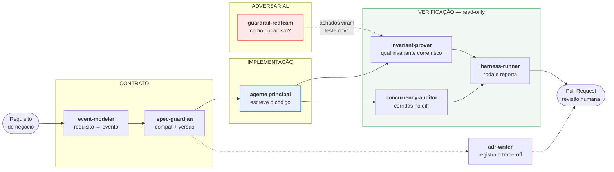

# Repositório AI-Native

> **Pilar 3, camada preventiva.** O enunciado supõe um time usando agentes de IA no dia a dia. Esta seção não descreve como isso seria configurado — ela **é** a configuração, versionada neste repositório e verificável.

## O que existe aqui

```
CLAUDE.md                      contrato operacional lido por todo agente
.claude/
  settings.json                registro dos hooks
  hooks/
    protect_paths.rb           PreToolUse — bloqueia escrita em caminho protegido
    invariants_after_edit.sh   PostToolUse — roda invariantes após editar lib/
    session_check.sh           Stop — impede terminar com drift
  agents/                      sete subagents com privilégio mínimo
  skills/add-event/            procedimento spec-driven de adicionar evento
harness/bin/sabotage           demonstração reproduzível dos guardrails
```

Nada disso é ilustração. `bin/sabotage` executa seis violações deliberadas e mostra a saída real de cada barreira — quem avalia pode clonar e conferir.

---

## Hooks: a diferença entre placa e porta trancada

`CLAUDE.md` é lido pelo modelo, que então decide se obedece. Um hook é executado pelo harness, e o agente não participa da decisão.

Essa distinção é a tese central do Pilar 3:

> **Guardrail confiável é o que não depende da cooperação do agente.**

| Hook | Quando | O que faz |
|---|---|---|
| `protect_paths.rb` | Antes de `Edit`/`Write` | Bloqueia escrita em contratos, invariantes, goldens, guardrails e código gerado |
| `invariants_after_edit.sh` | Após editar `lib/` | Roda as invariantes em ~3 s |
| `session_check.sh` | Ao encerrar | Falha se houver drift entre contrato e código, ou invariante pendente |

### Por que o bloqueio explica em vez de só recusar

O `stderr` de um hook `PreToolUse` volta para o agente como motivo da recusa. É a única mensagem que ele lê antes de decidir o que fazer em seguida, então ela precisa apontar **onde a mudança provavelmente deveria estar**:

```
BLOQUEADO: harness/spec/properties/idempotency_property_spec.rb é um caminho protegido.

São as invariantes que definem a corretude do sistema. Se um teste daqui está
vermelho, o código é que está errado.

Se a mudança que você quer fazer é de COMPORTAMENTO, ela provavelmente
pertence a outro lugar — veja a regra fundamental em CLAUDE.md.
```

Uma recusa seca faria o agente tentar de novo por outro caminho. Uma recusa que redireciona faz ele corrigir o rumo.

### Por que existe escotilha

`ULTRASYNC_ALLOW_PROTECTED=1` libera a escrita, com aviso. Proteção sem saída legítima é proteção que alguém acaba removendo por inteiro quando ela atrapalha uma vez — e o uso da escotilha fica visível no PR, que é exatamente o objetivo. O caminho protegido continua sob CODEOWNERS.

### Por que o PostToolUse não bloqueia

Ele reporta. Bloquear em `PostToolUse` seria tarde demais para impedir a escrita e cedo demais para julgar trabalho em andamento — um agente no meio de uma refatoração de três arquivos passa por estados intermediários vermelhos que são legítimos.

O valor está no **intervalo**: três segundos, com o contexto da mudança ainda vivo, contra minutos no CI, quando já se construiu mais coisa em cima do que quebrou.

---

## Subagents: separação por incentivo

Sete agentes, detalhados em [ADR-012](adr/012-arquitetura-multiagente.md). A regra estrutural:

> **Quem escreve o código não escreve a invariante que o restringe, e ninguém verifica o próprio trabalho.**



Três agentes são **read-only**, e é isso que dá valor ao que eles dizem. Um auditor que pode consertar o que encontrou tende a consertar em vez de reportar, e o achado nunca chega a quem precisava saber.

O `harness-runner` é o caso mais claro: quem executa a verificação **e** a conserta tem o mesmo incentivo que o desenho inteiro existe para neutralizar — a forma mais rápida de fazer um teste passar quase nunca é a correta.

### Quando não usar

A parte que costuma faltar em desenho multiagente.

| Mudança | Fluxo |
|---|---|
| Alterar `event_applier.rb` | Pipeline completo |
| Adicionar evento ao contrato | `event-modeler` → `spec-guardian` → `harness-runner` |
| Corrigir typo em documentação | **Nenhum agente** |
| Renomear variável local | Nenhum agente |

Rodar cinco agentes para corrigir um acento é a forma mais rápida de o time desligar a orquestração inteira.

---

## Skill `add-event`: procedimento executável

Adicionar um evento ao ciclo de vida tem ordem obrigatória — schema, exemplo, AsyncAPI, `bin/generate`, applier, propriedade, golden, ADR. Cada passo depende do anterior.

Deixar isso como **skill invocável** em vez de prosa no README significa que humanos e agentes seguem o mesmo procedimento, e que a ordem — que é onde mora a regra fundamental — não é reinterpretada a cada vez.

O passo 0 é o mais importante e o mais esquecido: **decidir se é mesmo um evento novo**. Como todos carregam estado completo, "um campo novo mudou" não justifica evento novo; justifica campo novo no estado.

---

## Demonstração reproduzível

```bash
cd harness && bin/sabotage
```

Seis violações deliberadas, cada uma revertida ao fim:

| # | Sabotagem | Camada | Barreira | Resultado |
|---|---|---|---|---|
| 1 | Editar arquivo de invariante | Preventiva | hook `PreToolUse` | **barrada** (exit 2) |
| 2 | Trocar `<` por `<=` | Detectiva | propriedade de monotonicidade | **barrada** |
| 3 | Marcar invariante como `xit` | Detectiva | `bin/test_inventory --check` | **barrada** |
| 4 | Editar código gerado | Detectiva | `bin/generate --check` | **barrada** |
| 5 | Campo obrigatório novo no contrato | Detectiva | `bin/schema_compat` | **barrada** |
| 6 | Enfraquecer golden de fronteira | Detectiva | `bin/mutate` | **barrada** |

A sexta é a mais instrutiva. Ela não quebra nenhum teste — o caso golden continua passando e continua parecendo cobrir despacho por peso. Só deixa de fixar o limite exato, que é justamente o que o operador `<=` decide. A suíte fica verde; a mutação encontra o sobrevivente.

### O que o roteiro encontrou

Escrever este script **quebrou duas vezes**, e as duas foram achados:

**A sabotagem 5 passou.** O `schema_compat` não detectava nome em `required` sem propriedade declarada — o walker só registrava campos existentes em `properties` e atravessava exatamente esse caso. É schema malformado com modo de falha traiçoeiro: o campo passa a ser exigido sem nunca ter sido declarado, e todo payload é rejeitado. Corrigido, e a verificação acrescentada.

**A sabotagem 6 passou na primeira versão.** Eu enfraquecia uma propriedade e esperava sobrevivente; a mutação continuou morta porque a **cobertura é redundante** — o teste unitário mata a mesma mutação. Boa notícia sobre a suíte, sabotagem mal escolhida. Retargetada para a fronteira dos casos golden, que é cobertura única.

Registrar isso importa: o roteiro serve de **teste de regressão dos próprios guardrails**. Se alguém enfraquecer uma proteção, a sabotagem correspondente para de ser barrada e o script falha.

---

## Limitação declarada

O formato de hooks, subagents e skills aqui é o do **Claude Code**. Gemini e GitHub Copilot têm mecanismos próprios, e esta configuração não é portável para eles.

O que é portável é o princípio, e ele é o que interessa:

- **Separar por incentivo**, não por diretório — quem implementa não valida.
- **Restringir por ferramenta**, não por instrução — o que o agente não pode fazer é melhor que o que ele foi orientado a não fazer.
- **Toda regra preventiva tem contraparte executável** no CI, que age independentemente de qual ferramenta gerou o código.

Essa última é a que sustenta a portabilidade real: as camadas detectiva e corretiva ([05-ai-harness.md](05-ai-harness.md)) não sabem nem se importam se o código veio de Claude, Gemini, Copilot ou de uma pessoa. A camada preventiva é a mais barata e a mais específica de ferramenta; as outras duas são o piso que vale para todas.

Fingir neutralidade seria pior que declarar o limite.

## Relacionadas

- [ADR-012](adr/012-arquitetura-multiagente.md) — separação de poderes
- [05-ai-harness.md](05-ai-harness.md) — camadas detectiva e corretiva
- [`CLAUDE.md`](../CLAUDE.md) — o contrato operacional
